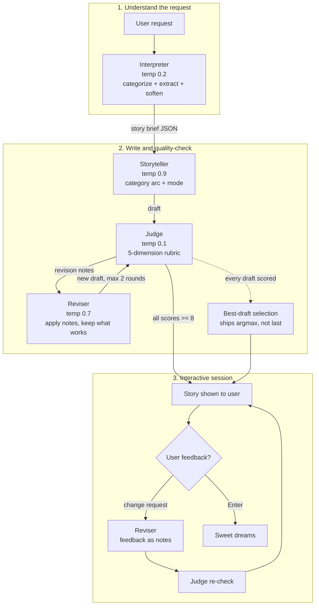

# Bedtime Story Agent

A multi-component pipeline that turns any story request into a bedtime story
appropriate for ages 5-10, using gpt-3.5-turbo for every role and an LLM
judge to enforce quality and safety before a story ever reaches the child.

Built for the Hippocratic AI coding assignment.

## How to run

```bash
python -m venv venv
source venv/bin/activate          # Windows: venv\Scripts\activate
pip install -r requirements.txt
export OPENAI_API_KEY="sk-..."    # your own key; never committed
python main.py
```

Run the unit tests (pure functions only; no API calls, no key needed):

```bash
python -m pytest test_pipeline.py -v
```

You will be asked for a story request and whether the story is for winding
down to sleep. After the story prints, you can request changes in plain
language ("add a puppy named Max"), or press Enter to finish.

## Architecture



One model, gpt-3.5-turbo (fixed by the assignment), plays every role. The
components differ only in system prompt, temperature, and output contract.

A full three-round transcript (draft, judge scores, revision notes, improved
draft, and the best-draft decision) is in [sample_output.md](sample_output.md),
regenerable with `python make_sample.py`.

| Component | Temperature | Why |
|---|---|---|
| Interpreter | 0.2 | Extraction and classification should be deterministic |
| Storyteller | 0.9 | Creative variety in drafts |
| Judge | 0.1 | Reproducible scoring |
| Reviser | 0.7 | Refine the existing draft, do not re-imagine it |

## Design decisions

- **Structured brief between user and storyteller.** The interpreter emits
  strict JSON (category, characters, setting, theme, adjustments). Downstream
  code branches on it, the judge scores against it as ground truth, and the
  `adjustments` list is an audit trail of every safety softening applied.
- **Category-tailored generation.** Each of the five request categories maps
  to a different story-arc template (journey-and-return, misunderstanding-
  and-repair, gentle-lesson, wonder-and-comfort, small-moment), so
  classification changes the story's structure, not just a label.
- **Judge with min-gating.** Five dimensions scored 1-10; a story ships only
  when every dimension reaches 8. Dimensions are not tradeable: a charming
  story with a safety of 6 is not a shippable bedtime story.
- **Redundant revision trigger.** A rewrite fires on the judge's verdict OR
  any sub-threshold score. Weak-model judges sometimes contradict themselves;
  the control logic assumes noisy signals.
- **Best-draft selection.** Rewrites are stochastic samples, not guaranteed
  improvements (observed live: round 3 scored below round 2). Every judged
  draft is ranked by (worst dimension, total) and the best one ships.
- **Feedback inside guardrails.** User change requests reuse the same reviser
  as judge notes and are re-judged before display. Tested with "make it
  scarier with monsters": the story changed substantially but came back
  gentler, not scarier.
- **Two story modes.** "Sleepy" winds the final third down to lullaby prose;
  "storytime" keeps a brighter (still gentle) ending. The mode threads
  through generation and every revision.

## Safety model

Three layers, in order: (1) the interpreter softens unsafe elements at the
source and logs each change; (2) the storyteller's system prompt forbids
violence, peril, and scary content; (3) the judge scores safety on every
draft, including feedback-driven ones, and gates release. Layers 1-2 are
probabilistic and occasionally leak; layer 3 exists to catch what they miss.

## Why these features

The feature set follows from asking who actually uses this. The real user is
a parent at 8:30pm, so the mode dial exists: sometimes the goal is sleep,
sometimes it is just a story. The listener is a child, so the feedback loop
is deliberately constrained: requests are honored inside the safe zone and
re-judged before display, which is why "make it scarier with monsters" comes
back gentler, not scarier. And because rewrites are samples rather than
guaranteed improvements, the pipeline ships the best judged draft it has
seen, not the most recent one. Testing splits along the same line: the
deterministic control logic has unit tests; the probabilistic LLM stages are
covered by scenario testing (a fixed clean/adversarial pair during
development, a full category sweep before submission, and the transcript in
sample_output.md).

## Known limitations

- Scary-flavored openings occasionally survive when the story resolves them
  gently; the judge treats resolved mild tension as acceptable for ages 5-10.
- The judge rubric is not conditioned on story mode, so storytime stories
  score slightly lower on bedtime_suitability. Fails in the safe direction;
  fixing it properly needs per-mode score baselines first.
- gpt-3.5-turbo sometimes drops spaces between words; the reviser fixes what
  the judge flags, but a deterministic post-processing pass would be more
  reliable than an LLM proofreader.
- Judge scores wobble by roughly a point run to run even at temperature 0.1;
  the control logic is designed around that noise rather than pretending it
  away.
- The interpreter sometimes over-softens: safe-but-adventurous elements (a
  sea voyage) can be rewritten away entirely, trading request fidelity for
  caution. It fails in the safe direction, but a production version would
  soften how events happen rather than whether they happen.
- No rubric dimension scores fidelity to the original request, so premise
  drift (a hedgehog who "can't sleep" becoming a hedgehog who watches a
  rainbow) passes the judge. Adding a "request_fidelity" dimension is the
  natural fix.

## Cost

A typical story uses 3-8 API calls (interpreter, storyteller, 1-3 judge
rounds, 0-2 revisions), well under $0.01 at gpt-3.5-turbo pricing.